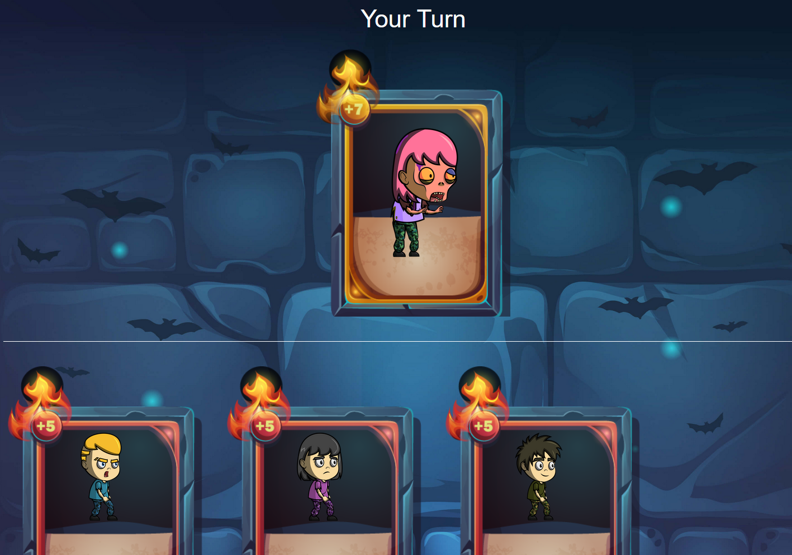

## Chapter 1: Lesson 2 Overview



In lesson 1, we created a function that takes a name, uses it to generate a random zombie, and adds that zombie to our app's zombie database on the blockchain.

In lesson 2, we're going to make our app more game-like: We're going to make it multi-player, and we'll also be adding a more fun way to create zombies instead of just generating them randomly.

How will we create new zombies? By having our zombies "feed" on other lifeforms!

### Zombie Feeding

When a zombie feeds, it infects the host with a virus. The virus then turns the host into a new zombie that joins your army. The new zombie's DNA will be calculated from the previous zombie's DNA and the host's DNA.

## Chapter 2: Mappings and Addresses

Let's make our game multi-player by giving the zombies in our database an owner.

To do this, we'll need 2 new data types: **mapping** and **address**.

### Addresses

The Ethereum blockchain is made up of **accounts**, which you can think of like bank accounts. An account has a balance of **Ether** (the currency used on the Ethereum blockchain), and you can send and receive Ether payments to other accounts, just like your bank account can wire transfer money to other bank accounts.

Each account has an **address**, which you can think of like a bank account number. It's a unique identifier that points to that account, and it looks like this:

**0x0cE446255506E92DF41614C46F1d6df9Cc969183**

(This address belongs to the CryptoZombies team. If you're enjoying CryptoZombies, you can send them some Ether! 😉 )

That an address is owned by a specific user (or a smart contract).

So we can use it as a unique ID for ownership of our zombies. When a user creates new zombies by interacting with our app, we'll set ownership of those zombies to the Ethereum address that called the function.

### Mappings

In Lesson 1 we looked at **structs** and **arrays**. **Mappings** are another way of storing organized data in Solidity.

Defining a **mapping** looks like this:
```
// For a financial app, storing a uint that holds the user's account balance:
mapping (address => uint) public accountBalance;
// Or could be used to store / lookup usernames based on userId
mapping (uint => string) userIdToName;
```
A mapping is essentially a key-value store for storing and looking up data. In the first example, the key is an **address** and the value is a **uint**, and in the second example the key is a **uint** and the value a **string**.